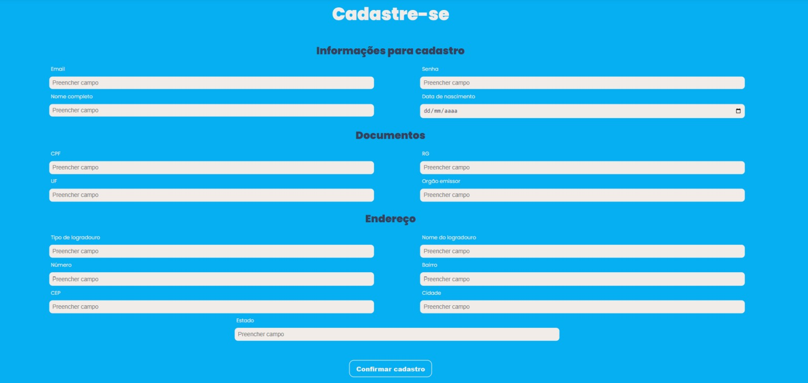
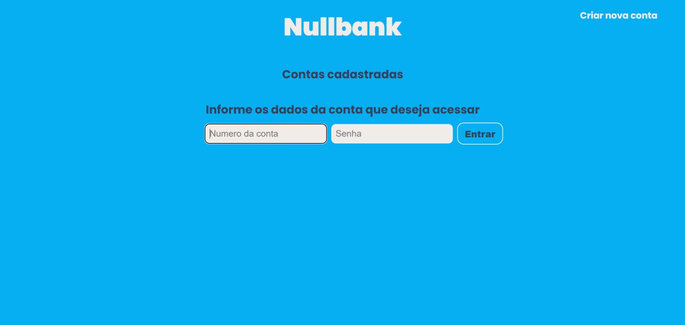
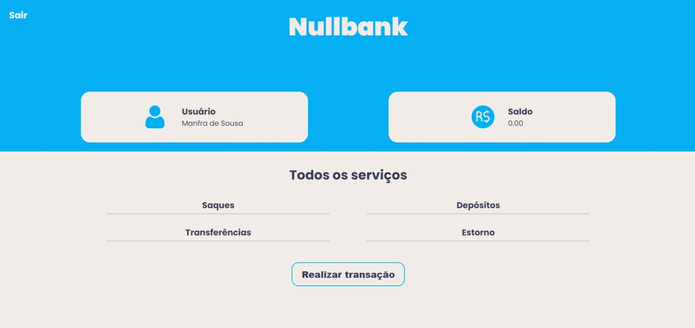

# Nullbank

## Sobre o projeto 

### Visão Geral

Este projeto foi proposto na disciplina de banco de dados, da Universidade Federal do Ceará (UFC) campus Sobral, lecionada pelo professor Fernando de Almeida, visando por em prática os conhecimentos adiquiridos durante o semestre.💻🎲

### Objetivo

- Cadastrar usuários
- Permitir que o usuário realize operações sobre suas contas (saque, depósito, transfrência e estorno)
- Permitir que os funcionários visualizem, editem ou façam transações nas contas do usúário, dependendo de qual seja sua fução (atendente, gerente, caixa ou DBA)

### Público

Comunidade da UFC 🎓

## :star: Algumas telas da aplicação

  

 

  

 

  

 

  

 

<h3 align="center"> 
	Status da Aplicação: Finalizado ✔️
</h3>
 

